<!-- This gives the ability to provide 'back to the top links -->
<a name="readme-top"></a>

<!-- PROJECT SHIELDS  - TOP OF PAGE -->
<!-- DOES NOT DISPLAY VALUES ON PRIVATE REPOSITORIES -->
[![Contributors][contributors-shield]][contributors-url]
[![Forks][forks-shield]][forks-url]
[![Stargazers][stars-shield]][stars-url]
[![Issues][issues-shield]][issues-url]
[![License][license-shield]][license-url]

Designed for: [Dark Mode Theme](https://github.com/settings/appearance "Enable Dark Mode")

<!-- PROJECT LOGO -->
<br />
<div align="center">
  <a href="https://github.com/ProfCyberNaught/php-directory-lister-breadcrumbs-non-recursive">
    
  </a>

<!-- PROJECT TITLE -->
  <h1 align="center">PHP DIRECTORY LISTER</h1>
  <h3 align="center">@ProfCyberNaught</h3><br /><br />

<!-- PROJECT SHORT DESCRIPTION -->
  <p align="center">
With this <b>PHP Directory Lister</b>, you can enjoy a wide range of customisable features, including <b>Light Mode</b> and <b>Dark Mode</b> themes, <b>breadcrumbs</b> links, hover-over <b>title tags,</b> <b>personalised</b> title and subtitle, back <b>to top links</b>, and even the option to <b>exclude specific files</b>. For a full list of the <b>features</b>, continue reading below.
  <br />
  <br />
    <a href="./LICENSE">License</a>
    ·
    <a href="https://github.com/ProfCyberNaught/php-directory-lister-breadcrumbs-non-recursive/issues">Report Bug</a>
    ·
    <a href="https://github.com/ProfCyberNaught/php-directory-lister-breadcrumbs-non-recursive/issues">Request Feature</a>
  </p>
</div>

<br /><br />

<!-- TABLE OF CONTENTS -->
#### Table of Contents

- [About PHP Directory Lister](#about-the-php-directory-lister "PHP Directory Lister with Breadcrumbs - ProfCyberNaught")
    - [Themed Screenshots](#themed-screenshots "Themed Screenshots - PHP Directory Lister with Breadcrumbs - ProfCyberNaught")
        - [Light Mode Screenshot](#themed-screenshots "Light Mode Screenshot - PHP Directory Lister with Breadcrumbs - ProfCyberNaught")
        - [Dark Mode Screenshot](#themed-screenshots "Dark Mode Screenshot - PHP Directory Lister with Breadcrumbs - ProfCyberNaught")
    - [Future Development Ideas](#future-development-ideas "Future Development Ideas - PHP Directory Lister with Breadcrumbs - ProfCyberNaught")
- [How to use it](#how-to-use-it "How to use it - PHP Directory Lister with Breadcrumbs - ProfCyberNaught")
- [Customisable Features](#customisable-features "Customisable Features - PHP Directory Lister with Breadcrumbs - ProfCyberNaught")
    - [Changing Themes](#changing-themes "Changing Themes - PHP Directory Lister with Breadcrumbs - ProfCyberNaught")
        - [Enable Light Mode Theme](#enable-light-mode-theme "Enable Light Mode Theme - PHP Directory Lister with Breadcrumbs - ProfCyberNaught")
        - [Enable Dark Mode Theme](#enable-dark-mode-theme "Enable Dark Mode Theme - PHP Directory Lister with Breadcrumbs - ProfCyberNaught")
            - [Change Dark Mode Accent Colour](#change-dark-mode-accent-colour "Change Dark Mode Accent Colour - PHP Directory Lister with Breadcrumbs - ProfCyberNaught")
    - [Toggle Breadcrumb Links](#toggle-breadcrumb-links "Breadcrumbs Links - PHP Directory Lister with Breadcrumbs - ProfCyberNaught")
    - [Toggle Hover-Over Title Tags](#toggle-hover-over-title-tags "Toggle Hover-Over Title Tags - PHP Directory Lister with Breadcrumbs - ProfCyberNaught")
    - [Toggle Back to Top Links](#toggle-back-to-top-links "Toggle Back to Top Links - PHP Directory Lister with Breadcrumbs - ProfCyberNaught")
    - [Toggle Hover Highlight Bar](#toggle-hover-highlight-bar "Toggle Hover Highlight Bar - PHP Directory Lister with Breadcrumbs - ProfCyberNaught")
    - [Change or Disable Title Text Options](#change-or-disable-title-text-options "Change or Disable Title Text Options - PHP Directory Lister with Breadcrumbs - ProfCyberNaught")
        - [Custom Page Title](#custom-page-title "Custom Page Title - PHP Directory Lister with Breadcrumbs - ProfCyberNaught")
        - [Custom Page Subtitle](#custom-page-subtitle "Custom Page Subtitle - PHP Directory Lister with Breadcrumbs - ProfCyberNaught")
    - [Toggle List Icons](#toggle-list-icons "Toggleable List Icons - PHP Directory Lister with Breadcrumbs - ProfCyberNaught")
    - [Toggle Favicon Icon](#toggle-favicon-icon "Toggle Favicon Icon - PHP Directory Lister with Breadcrumbs - ProfCyberNaught")
      - [Add Custom Favicon](#add-custom-favicon "Add Custom Favicon - PHP Directory Lister with Breadcrumbs - ProfCyberNaught")
    - [Toggle Last Modified Info](#toggle-last-modified-info "Toggle Last Modified Info - PHP Directory Lister with Breadcrumbs - ProfCyberNaught")
    - [Toggle File Size Info](#toggle-file-size-info "Toggle File Size Info - PHP Directory Lister with Breadcrumbs - ProfCyberNaught")
    - [File Exclusion List](#file-exclusion-list "File Exclusion List - PHP Directory Lister with Breadcrumbs - ProfCyberNaught")
        - [Add File to Exclusion List](#add-file-to-exclusion-list "Add File to Exclusion List - PHP Directory Lister with Breadcrumbs - ProfCyberNaught")
        - [Remove File from Exclusion List](#remove-file-from-exclusion-list "Remove File from Exclusion List - PHP Directory Lister with Breadcrumbs - ProfCyberNaught")
        - [Use an Empty Exclusions List](#use-an-empty-exclusions-list "Use an Empty Exclusions List - PHP Directory Lister with Breadcrumbs - ProfCyberNaught")
    - [Customise Copyright Info](#customise-copyright-info "Customise Copyright Info - PHP Directory Lister with Breadcrumbs - ProfCyberNaught")
        - [Add Copyright Name](#add-copyright-name "Add Copyright Name - PHP Directory Lister with Breadcrumbs - ProfCyberNaught")
        - [Add Copyright Year](#add-copyright-year "Add Copyright Year - PHP Directory Lister with Breadcrumbs - ProfCyberNaught")
            - [Add Copyright Start Year](#add-copyright-start-year "Add Copyright Start Year - PHP Directory Lister with Breadcrumbs - ProfCyberNaught")
            - [Add Copyright End Year](#add-copyright-end-year "Add Copyright End Year - PHP Directory Lister with Breadcrumbs - ProfCyberNaught")
        - [Add Copyright URL](#add-copyright-url "Add Copyright URL - PHP Directory Lister with Breadcrumbs - ProfCyberNaught")
            - [Add Copyright URL Title Tag](#add-copyright-url-title-tag "Add Copyright URL Title Tag - PHP Directory Lister with Breadcrumbs - ProfCyberNaught")
    - [Change Open Link Behaviour](#change-open-link-behaviour "Change Open Link Behaviour - PHP Directory Lister with Breadcrumbs - ProfCyberNaught")
        - [Open Links: Same Tab](#open-links-same-tab "Open Links: Same Tab - PHP Directory Lister with Breadcrumbs - ProfCyberNaught")
        - [Open Links: New Tab](#open-links-new-tab "Open Links: New Tab - PHP Directory Lister with Breadcrumbs - ProfCyberNaught")
- [FAQ Section](#faq-section "F.A.Q Section - PHP Directory Lister with Breadcrumbs - ProfCyberNaught")
- [Contact](#contact "Contact - PHP Directory Lister with Breadcrumbs - ProfCyberNaught")
- [Attribution](#attribution "Attribution - PHP Directory Lister with Breadcrumbs - ProfCyberNaught")
    - [Original Concept](#original-concept "Original Concept - PHP Directory Lister with Breadcrumbs - ProfCyberNaught")
    - [Icon Usage](#icon-usage "Icon Usage - PHP Directory Lister with Breadcrumbs - ProfCyberNaught")
- [License](./LICENSE "License - PHP Directory Lister with Breadcrumbs - ProfCyberNaught")
<br /><br />


<!-- ABOUT THE PROJECT -->
## About the PHP Directory Lister

<div align="center">
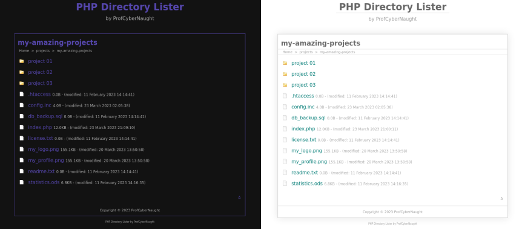
</div>

Introducing the **PHP Directory Lister!** being released as an open-source project to the public, which is designed to provide a _professional and customisable_ directory listing experience. This **PHP Directory Lister** is the perfect **single file solution** for users who require a more **refined and polished** directory list compared to the standard _Apache_ implementation.

With this single file **PHP Directory Lister**, you can enjoy a wide range of **customisable features**, including:

- Light Mode Theme
- Dark Mode Theme
- Breadcrumbs Links
- Personalised Page Title
- Personalised Page Subtitle
- Toggleable Hover-over Title Tags
- Toggleable List Icons
- Toggleable File Last Modified Info
- Toggleable Hover Highlight Bar
- Toggleable Back to Top Links
- Customisable File Exclusion List
- Change Dark Mode Accent Colour
- Customisable Copyright Text, Years, Links and more
- Toggleable Option to Open New Link in New Tab or Same Window

Other _fantastic features_ include:

- Single File Implementation
- Minified Code
- Base64 Icons
- No Javascript or JQuery
- Purely HTML, CSS, and PHP
- Responsive
- Mobile Friendly
- Tablet Friendly
- Tested on multiple Internet Browsers, Servers, Operating Systems, and Portable Devices
- Suitable for Localhost or Remote Implementation

This single file implementation is minified to reduce server load, while still providing all of the customisable options at the top, ensuring a fast and efficient user experience.

This **PHP Directory Lister** is _not recursive_, meaning it has the benefit of **only displaying content from the directory** where the code is placed. However, it provides **21 unique features** that can be **tailored** to your exact **requirements**. The **directories** are listed at the top, with **files** displayed underneath, in **alphabetical order**, making it **easy to navigate** your _files and folders_.

At only **11.8KB in size**, this **PHP Directory Lister** is _lightweight_, _fast_, and _perfect_ for localhost users who are seeking a more **professional-looking directory lister**. It's an **ideal solution** for home projects, allowing you to list all your **files or project folders** in your localhost, with the ability to use different **customised settings** for each project.

You are encourage to **fork and star the repository** to support this **open-source initiative**, and look forward to seeing the innovative ways in which this **PHP Directory Lister** can be utilised. Thank you for choosing this **PHP Directory Lister** - be confident that you will find it to be an **invaluable tool** for **listing your files and folders**.

<!-- HELP NOTICE: All sections must end with the 'back to top' link -->
<p align="right">(<a href="#readme-top">back to top</a>)</p>

## Themed Screenshots

This **PHP Directory Lister** single file solution comes with two themes. The default theme is the Light Mode but users are able to switch to the **Dark Mode** theme easily. Users can also change the accent colour of the dark theme _(default is purple)_ to which ever colour you choose. Again, this option has been provided within the options of the single file solution.

Below is both the **Light Mode Theme** _(right image)_ and **Dark Mode Theme** _(left image)_:

<div align="center">

</div>

Below is the **Light Mode Theme** with example features highlighted:

<div align="center">
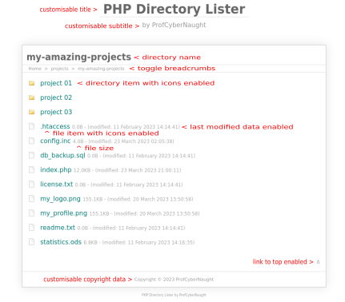
</div>

Below is a customisable **Dark Mode Green Accent Colour** applied:

<div align="center">
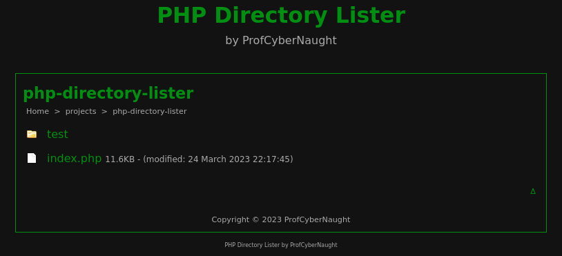
</div>

Below is the **Light Mode** with all customisable options disabled:

<div align="center">
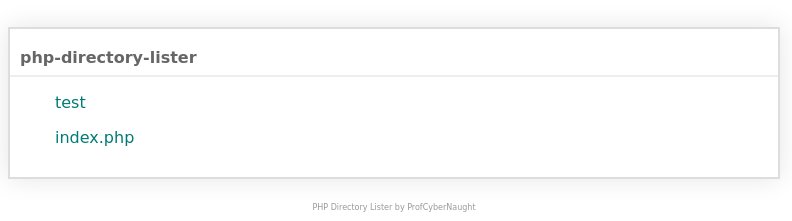
</div>

Below is the **Dark Mode** with all customisable options disabled:

<div align="center">
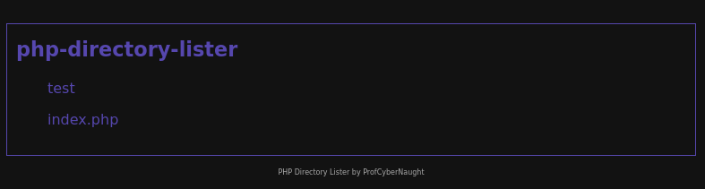
</div>

<!-- HELP NOTICE: All sections must end with the 'back to top' link -->
<p align="right">(<a href="#readme-top">back to top</a>)</p>

### Future Development Ideas

Having developed numerous **PHP Directory Listers** over the years for my development and production environments, I am always thinking of ways in which I could add additional functionality. However, the goal would still remain to create a _'single file solution'_ keeping the process simple, whist adding customised functionalities.

Here are a list of potential future developments:

- Ability to add custom icons
- Ability to add custom file types
- Save directory list results to text file _(single click)_
- More theme options
- Ability to control more theme elements
- A recursive version
  - Sub directory depth controls
  - File type controls

All of the above could still be implemented within the _'single file solution'_ already presented. However, it is about time availability, and poetntial usage of such new features adding benefit to the user.

If you can come up with more ideas sticking to the _'single file solution'_ methodology, please do get in contact or open an issue to suggest a new feature.

<!-- HELP NOTICE: All sections must end with the 'back to top' link -->
<p align="right">(<a href="#readme-top">back to top</a>)</p>

## How to use it

This **PHP Directory Lister** has been developed with a simple goal in mind, to be a 'single file solution' for adding a visual representation of your chosen directory contents with plenty of customisable features. With this in mind, all you need to get this working is the `index.php` file itself. There are a few ways you can install this **PHP Directory Lister**:

- Copy & Paste using the raw data file
- Download the full repository zip file
- Use cURL in your terminal
- Use wget in your terminal

**Copy &amp; Paste Method:**<br />
You can view the raw data for the `index.php` file on this GitHub repository. You can then highlight all the data contained within the file, copy it, then paste it into your chosen `.php` file. Remember, just because I have named it `index.php` does not mean you have to. You can name it anything you want but remember, an index file is loaded straight away by default on your localhost. If you change the name, you will have to manually enter the file name in your browser address bar, or change your localhost settings to load a different file first.

You can view the raw data by clicking this link: [View PHP Directory Lister Raw Data File](https://raw.githubusercontent.com/ProfCyberNaught/php-directory-lister-breadcrumbs-non-recursive/master/index.php "View PHP Directory Lister Raw Data File - ProfCyberNaught")

**Download Full Repository Zip Method:**<br />
Another method is downloading the full repository which will contain everything you see in this instance. You do not need anything else but having the instructions contained within this `README.md` file locally might be a great way forward. Don't forget to star the repository in your GitHub account to return to when required. You can also folk the repository if you like.

You can download the repository zip file by clicking this link: [Download PHP Directory Lister Master Zip File](https://github.com/ProfCyberNaught/php-directory-lister-breadcrumbs-non-recursive/archive/refs/heads/master.zip "Download PHP Directory Lister Master Zip File - ProfCyberNaught")

**Use cURL in your Command Line Method:**<br />
You can also very quickly install this **PHP Directory Lister** _(you only need the single `index.php` file)_ using cURL in your command line application. You will clearly need cURL installed on your system to use this command:

`curl -O https://raw.githubusercontent.com/ProfCyberNaught/php-directory-lister-breadcrumbs-non-recursive/master/index.php`

<ins>**NOTICE:**</ins> _Make sure you are using your command line interface and have directed your command line to your chosen directory when you want to download and install the file._

**Use wget in your Command Line Method:**<br />
You can also use wget from your command line interface and download the single `index.php` file directly into the location you need. As with the cURL option above, you will need wget installed on your system and then navigate to your chosen location from within your command line interface:

`wget -O index.php https://raw.githubusercontent.com/ProfCyberNaught/php-directory-lister-breadcrumbs-non-recursive/master/index.php`

<!-- HELP NOTICE: All sections must end with the 'back to top' link -->
<p align="right">(<a href="#readme-top">back to top</a>)</p>

## Customisable Features

The **PHP Directory Lister** single file solution comes with many customisable options to suite your needs. Below you will find each option with instructions and potential screenshots.

Here is a list of all the options available within the single file solution at the top:

- `$display_page_title=TRUE;`
- `$display_page_subtitle=TRUE;`
- `$display_breadcrumbs=TRUE;`
- `$display_icons=TRUE;`
- `$display_file_sizes=TRUE;`
- `$display_last_modified_info=TRUE;`
- `$display_link_hover_title_tags=TRUE;`
- `$display_link_hover_bar=TRUE;`
- `$display_back_to_top_link=TRUE;`
- `$display_copyright_notice=TRUE;`
- `$enable_darkmode_theme=FALSE;`
- `$darkmode_colour="#5647ae";`
- `$page_title="PHP Directory Lister";`
- `$page_subtitle="by ProfCyberNaught";`
- `$copyright_display_name="ProfCyberNaught";`
- `$copyright_url="https:// github.com/ProfCyberNaught";`
- `$copyright_link_title_tag="ProfCyberNaught on GitHub";`
- `$copyright_year_start="";`
- `$copyright_year_end="";`
- `$exclude=array('.','..','.DS_Store','.git','.gitmodules','.gitignore','node_modules');`
- `$open_links_new_tab=FALSE;`

<!-- HELP NOTICE: All sections must end with the 'back to top' link -->
<p align="right">(<a href="#readme-top">back to top</a>)</p>

### Changing Themes

You have the option of switching between two default themes. The first is **Light Mode** and the second is **Dark Mode**. By default, the **Light Mode** is activated upon initial usage. You can enable or disable your chosen theme using the instructions below:

#### Enable Light Mode Theme

The **Light Mode theme** is enabled by default in the options. However, if you have switched to the dark theme you can change back to the light theme by altering the `$enable_darkmode_theme` option and setting to `FALSE`.

```$enable_darkmode_theme=FALSE;```

<!-- HELP NOTICE: All sections must end with the 'back to top' link -->
<p align="right">(<a href="#readme-top">back to top</a>)</p>

#### Enable Dark Mode Theme

The **Dark Mode theme** is disabled by default in the options. However, if you want to switch to the dark theme you can by altering the `$enable_darkmode_theme` option and setting to `TRUE`.

```$enable_darkmode_theme=TRUE;```

<!-- HELP NOTICE: All sections must end with the 'back to top' link -->
<p align="right">(<a href="#readme-top">back to top</a>)</p>

#### Change Dark Mode Accent Colour

You are able to change the main accent colour of the **Dark Mode Theme** to any colour you want. Example colours have been provided within the single file solution for you to try. The default colour upon Dark Mode activation is purple _(#5647ae)_ and you can change this option _(retaining the '#' symbol)_ as follows:

- `$darkmode_colour="#5647ae";` Purple

<div align="center">
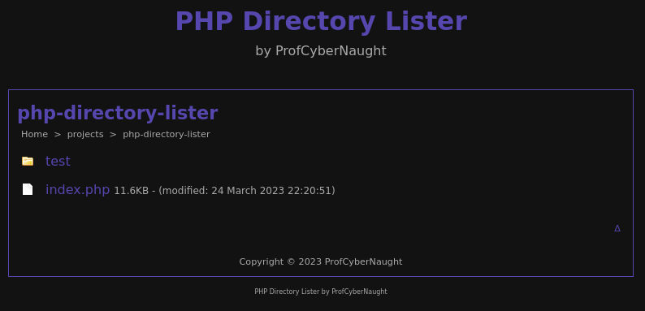
</div>

- `$darkmode_colour="#0000ff";` Blue

<div align="center">
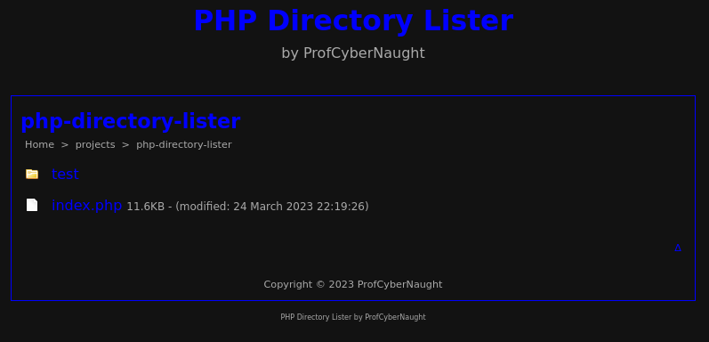
</div>

- `$darkmode_colour="#ff0b86";` Pink

<div align="center">
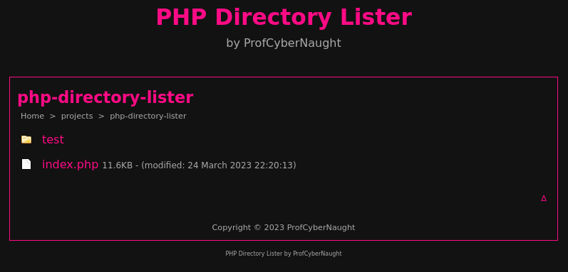
</div>

- `$darkmode_colour="#6e0508";` Red

<div align="center">
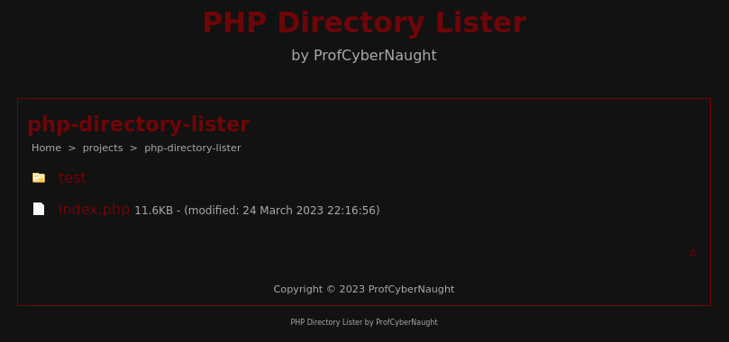
</div>

- `$darkmode_colour="#008F11";` Green _(this is the official 'Matrix' colour value)_

<div align="center">

</div>

<ins>**NOTICE:**</ins> _You can change the colour value to anything you like. Your choices are endless and why not assign different colours to each project directory you chosen to use the PHP Directory Lister within._

<!-- HELP NOTICE: All sections must end with the 'back to top' link -->
<p align="right">(<a href="#readme-top">back to top</a>)</p>

### Toggle Breadcrumb Links

The breadcrumbs give you a visable cue as to where you currently are in the directory. Home will always be your default localhost root directory where you first place the **PHP Directory Lister** file. You can place this file in multiple directories and you will be presented with the same layout you have set within the options.

If you want to disable the breadcrumbs _(enabled by default)_, you can change the `$display_breadcrumbs` setting to `FALSE`.

Here is what it looks like without the breadcrumbs enabled:

<div align="center">
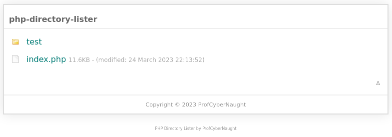
</div>

<!-- HELP NOTICE: All sections must end with the 'back to top' link -->
<p align="right">(<a href="#readme-top">back to top</a>)</p>

### Toggle Hover-Over Title Tags

When you hover over a link with your curser, by default you will be presented with a popup title tag displaying the link title. This is great for those whom use small fonts or zoomed-out screens because by hovering over a link, it can tell you what it is. However, if you prefer not to have hover title tag links as some programmers and developers do, you can switch these off by changing the `$display_link_hover_title_tags` settings to `FALSE`.

<!-- HELP NOTICE: All sections must end with the 'back to top' link -->
<p align="right">(<a href="#readme-top">back to top</a>)</p>

### Toggle Back to Top Links

Depending on how many directories and files you have within the same location as the **PHP Directory Lister** single file solution, you may need to have the _'back to top'_ link so you can quickly return to the top of your directory contents list. This is enabled by default but you can stop this from showing by disabling it changing the `$display_back_to_top_link` setting to `FALSE`.

This is what it looks like when enabled _(triangle pointing up on the bottom right)_:

<div align="center">
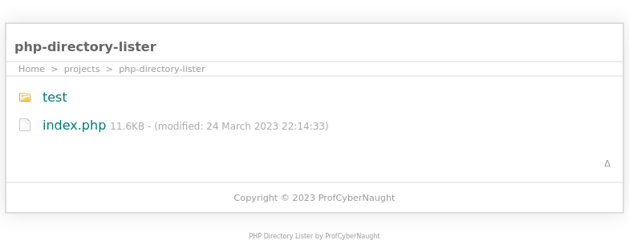
</div>

This is what it looks like with it disabled:

<div align="center">
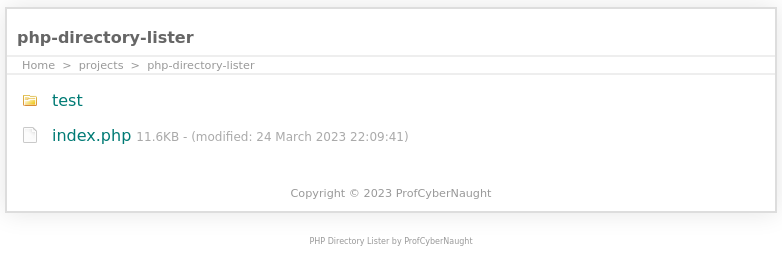
</div>

<ins>**NOTICE:**</ins> _You will not see the triangle pointing up in the bottom right corner when disabled._

<!-- HELP NOTICE: All sections must end with the 'back to top' link -->
<p align="right">(<a href="#readme-top">back to top</a>)</p>

### Toggle Hover Highlight Bar

When you hover your curser over an item within your directory list results, you are presented with a coloured bar to show you which item you are selecting. This can really help quickly identify where your curser is and which result is being actioned. If you prefer not to have this displayed, you can disable it by changing the `$display_link_hover_bar` setting to `FALSE`.

This is what it looks like in **Light Mode** _(grey bar)_:

<div align="center">
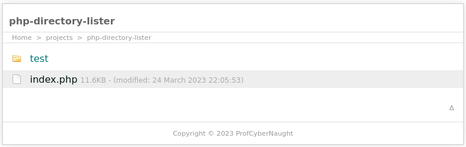
</div>

This is what it looks like in **Dark Mode** _(purple bar)_:

<div align="center">
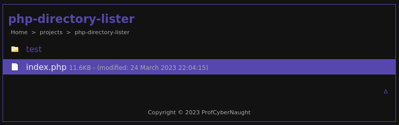
</div>

<ins>**NOTICE:**</ins> _If you use a custom accent colour with your Dark Mode enabled, your highlight bar will also be this colour._

<!-- HELP NOTICE: All sections must end with the 'back to top' link -->
<p align="right">(<a href="#readme-top">back to top</a>)</p>

### Change or Disable Title Text Options

You can keep the title or subtitle text the same as the default set, you can change the values to anything you want, or you can disable them both if you feel you do not need to see them. However, they can really help when using this single file solution in multiple project directories. It will allow you to customise each instance to match your directory choice or personal projects.

To disable either one, you can change the `$display_page_title` setting or `$display_page_subtitle` setting to `FALSE`.

<ins>**NOTICE:**</ins> _You must have the `$display_page_title` option enabled to see the 'subtitle text'. You cannot display the subtitle without the main title as the name itself states, it is sub (i.e., below) the main title. However, you can display the main title without the need to have a subtitle._

_The current directory name is displayed in the browser tab title by default. This is also where your favicon will be displayed if you choose to use one._

<!-- HELP NOTICE: All sections must end with the 'back to top' link -->
<p align="right">(<a href="#readme-top">back to top</a>)</p>

#### Custom Page Title

You can change the text displayed as the main title by replacing the data in the `$page_title` setting to anything you want. Example: `$page_title="My Great Project";`.

<!-- HELP NOTICE: All sections must end with the 'back to top' link -->
<p align="right">(<a href="#readme-top">back to top</a>)</p>

#### Custom Page Subtitle

You can change the text displayed as the subtitle by replacing the data in the `$page_subtitle` setting to anything you want. Example: `$page_subtitle="A Professional Adventure";`.

<ins>**REMEMBER:**</ins> _You must have the `$display_page_title` setting enabled to see the subtitle. However, you can just have the main title displayed without the subtitle showing. Remember, sub means 'below' something._

<!-- HELP NOTICE: All sections must end with the 'back to top' link -->
<p align="right">(<a href="#readme-top">back to top</a>)</p>

### Toggle List Icons

The **PHP Directory Lister** uses two distinct png images to signify the difference between a directory and a file. One is the image of a folder, and the other is an image of a blank document. These images are stored within the single file solution as `Base64` encoded data. This provides the added benefit of not having the need to copy images into your directory. Everything is included within the single file supplied.

The icons are enabled by default but you can disable them by changing the `$display_icons` setting to `FALSE`.

This is what it looks like with icons enabled:

<div align="center">

</div>

This is what it looks like with icons disabled:

<div align="center">
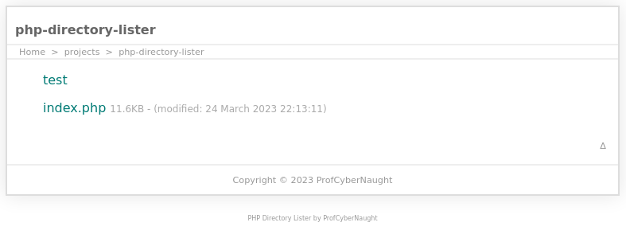
</div>

<ins>**NOTICE:**</ins> _It is possible to add more icons or change the existing icons. However, this would be for an intermediate or advanced user. However, if you wish to know about how to do it, why not get in [contact](#contact "Contact - PHP Directory Lister - ProfCyberNaught") with ProfCyberNaught to see if any assistance is available or why not [open an issue](https://github.com/ProfCyberNaught/php-directory-lister-breadcrumbs-non-recursive/issues "Open an Issue - PHP Directory Lister - ProfCyberNaught") and suggest a new feature on the GitHub repository. You may also want to read the [FAQ Section](#faq-section "FAQ Section - PHP Directory Lister - ProfCyberNaught") before you do as some features may require extensive coding and time._

<!-- HELP NOTICE: All sections must end with the 'back to top' link -->
<p align="right">(<a href="#readme-top">back to top</a>)</p>

### Toggle Favicon Icon

You are able to display your chosen favicon in the browser tab window for the **PHP Directory Lister**. This can be customised as a standard icon for all your directories, or you can assign a per project or per directory favicon as required.

In order to enable the favicon icon, you need to change the `$display_favicon` setting to `TRUE`. By default, the favicon icon is disabled.

<ins>**NOTICE:**</ins> _You must have a value saved in the `$favicon_link` setting before the favicon will display. This means, if you have no value saved and you enable the favicon, you will not see it displayed (as there will be nothing to display)._

<!-- HELP NOTICE: All sections must end with the 'back to top' link -->
<p align="right">(<a href="#readme-top">back to top</a>)</p>

#### Add Custom Favicon

Adding a custom favicon is a simple process. If you already have your own `favicon.ico` file you would like to use, you can simply add your link to the file in the `$favicon_link` setting. The default is an empty value ready to accept your chosen favicon location.

There are a number of ways you can add a favicon icon:

- Local Resource
- Remote Resource

**Local Resource:**<br />
You can add a local resource as follows: `http://localhost/favicon.ico`. Using this method allows you to link to the same locally stored favicon file for all instances no matter where you store this single file solution. However, you can choose specific locations based on your project needs as follows: `/favicon.ico`. This method will try load the favicon file from the same location this **PHP Directory Lister** file is stored. This means you can use a project specific favicon as required.

**Remote Resource:**<br />
Working locally, I would not advise setting a remote favicon file to be loaded. This would ultimately mean, you need an active internet connection just for the file to be loaded and displayed. Some localhost environments are not actively connected to the internet for development reasons. However, if you would prefer to load a remote favicon, you can do so by providing the full URL to the favicon file. An example would be: `https://github.githubassets.com/favicons/favicon.svg`. The example is a direct link to the GitHub favicon used on the main GitHub website. However, your location could be anywhere you have saved your favicon file.

<!-- HELP NOTICE: All sections must end with the 'back to top' link -->
<p align="right">(<a href="#readme-top">back to top</a>)</p>

### Toggle Last Modified Info

You are able to see the date of last modification for the files within your chosen project directory. This feature can really help you know which file was changed recently, and which ones might need updating or verifying. However, if you do not need to see this last modification date, you can disable it by changing the `$display_last_modified_info` setting to `FALSE`.

This is what it looks like enable _(last modified text)_:

<div align="center">

</div>

This is what it looks like disabled:

<div align="center">
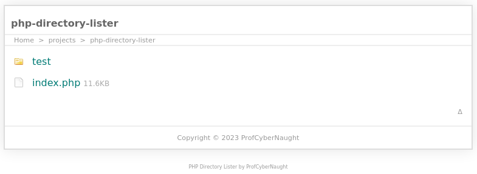
</div>

<!-- HELP NOTICE: All sections must end with the 'back to top' link -->
<p align="right">(<a href="#readme-top">back to top</a>)</p>

### Toggle File Size Info

You are able to display the file size information for each specific file located in your chosen directory. This helps give you a quick overview of all your files and their respective file sizes.

You can enable this by changing the `h` setting to `TRUE`. This is enabled by default. If you want to disable this file size view, you can set the value to `FALSE`.

This is what it looks like with the file size option enabled _(set to TRUE)_:

<div align="center">

</div>

This is what it looks like with the file size option disabled _(set to FALSE)_:

<div align="center">
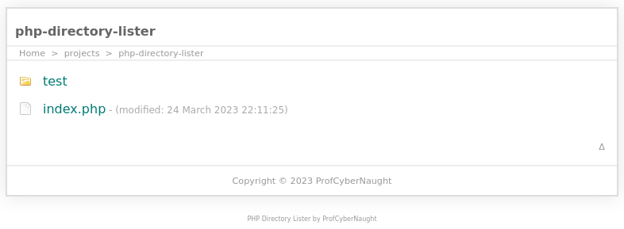
</div>

<!-- HELP NOTICE: All sections must end with the 'back to top' link -->
<p align="right">(<a href="#readme-top">back to top</a>)</p>

### File Exclusion List

<ins>**WARNING:**</ins> _This can seem rather complicated if you are a beginner. Take your time and pay attention to the detailed instructions below._

This is a fantastic option to have in a **PHP Directory Lister** single file solution. This really adds some additional and customisable controls to the user. You have the option to add certain files or folders to the exclusion list if you do not want them to be displayed. You also have the option to remove any of the default exclusions.

Examples of excluded files or folders could consist of your _GitHub directories_, this very `index.php` page, or specific files or directories you know you do not need to see _(some files will never be changed by you or the project you are working on)_.

The default exclusion list consists of the following:

- '.'
- '..'
- '.DS_Store'
- '.git'
- '.gitmodules'
- '.gitignore'
- 'node_modules'

The first two are common directory listing options presented when listing items within a directory. They allow you to traverse back one or two steps as required. However, if you have **breadcrumbs enabled by default**, these are no longer needed. The rest are application specific or user choice. Feel free to add or remove any from the exclusions list.

This is what the custom `$exclude` setting looks like by default:

`$exclude=array('.','..','.DS_Store','.git','.gitmodules','.gitignore','node_modules');`

<ins>**NOTICE:**</ins> _If you disable the breadcrumbs links, you might want to remove the first two excluded items from your list to give you the option to go back through your directories (commas separate your items and each item must be enclosed in single apostrophes: 'YOUR-ITEM'. The last item must not have a comma trailing as seen in the default exclusion list above)._

<!-- HELP NOTICE: All sections must end with the 'back to top' link -->
<p align="right">(<a href="#readme-top">back to top</a>)</p>

#### Add File to Exclusion List

To add a file to the exclusion list, you need to add your item to the `$exclude` setting. The order in which they are listed in the setting does not matter. However, how we add an item to the exclusion is governed by how we correctly create PHP syntax.

Here is the default exclusion list setting:

`$exclude=array('.','..','.DS_Store','.git','.gitmodules','.gitignore','node_modules');`

Each item is separated by a trailing comma ',' unless it is the last item in the list. Below is an example of how you can add an item to the exclusion list:

`$exclude=array('.','..','.DS_Store','.git','.gitmodules','.gitignore','node_modules','additional_item');`

If you notice, the only change made is the text `,'additional_item'` has been appended to the end. We start with a comma, then single apostrophe, our list name _(no spaces and try to only use full stops `.`, hyphens `-` and underscores `_` )_, then another single apostrophe. Your list item can be the name of a directory or the full name of a file _(including extension: myfile.php)_.

For example, if you want to not display this PHP Directory Lister file _(because it would be the file you are currently viewing if it is called index.php)_, you can add this file name `index.php` to your list as follows:

`$exclude=array('.','..','.DS_Store','.git','.gitmodules','.gitignore','node_modules','index.php');`

This will result in the `index.php` _(this file)_ from not displaying in your directory listing results. Sometimes, this makes perfect sense because you will know you have an index file becasue you will be viewing it at the time of viewing your directory list results. However, some developers prefer to see every file in the directory and as a result, will have a blank exclusions list.

Here is what it looks like when you allow the `.git` folder name to show _(i.e., not included in the exclusion list)_:

<div align="center">
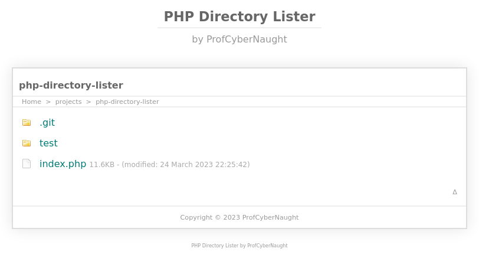
</div>

Here is what it looks like when the `.git` folder name in added to the exclusion list _(i.e., do not display)_:

<div align="center">
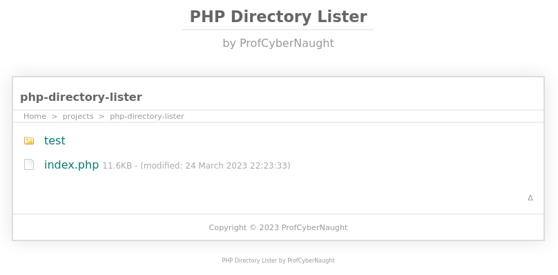
</div><br />

Example exclusion list would look like this _(to display the `.git` folder)_: `$exclude=array('.','..','.DS_Store','.gitmodules','.gitignore','node_modules');`<br />
Example exclusion list would look like this _(to not display the `.git` folder)_: `$exclude=array('.','..','.DS_Store','.git','.gitmodules','.gitignore','node_modules');`

<!-- HELP NOTICE: All sections must end with the 'back to top' link -->
<p align="right">(<a href="#readme-top">back to top</a>)</p>

#### Remove File from Exclusion List

As with adding a item to your exclusion list, you can also remove items too. These items can be either a directory name or a file name ending with the extension _(example: index.php)_. If you want to remove an item from your exclusions list, you need to change the `$exclude` setting.

This is what the default exclusion list looks like:

`$exclude=array('.','..','.DS_Store','.git','.gitmodules','.gitignore','node_modules');`

Let us now remove the first two items `'.'` and `'..'`. _Remember, we might need to remove this two items if we have disabled the breadcrumbs if you prefer them to display._ We can do this by removing those two items along with the commas like so:

`$exclude=array('.DS_Store','.git','.gitmodules','.gitignore','node_modules');`

The text removed was: `'.','..',` but nothing else was changed.

<!-- HELP NOTICE: All sections must end with the 'back to top' link -->
<p align="right">(<a href="#readme-top">back to top</a>)</p>

#### Use an Empty Exclusions List

If you want to display every single file and folder regardless of what they are, you can do this by having an empty exclusion list `$exclude` setting like so:

`$exclude=array();`

The above exclusion list contains no files or folders and will result in no restrictions being applied to displaying files and folders.

<!-- HELP NOTICE: All sections must end with the 'back to top' link -->
<p align="right">(<a href="#readme-top">back to top</a>)</p>

### Customise Copyright Info

This **PHP Directory Lister** single file solution allows you to add custom copyright information to your directory list page projects. This does not mean, you now own copyright to this **PHP Directory Lister** but it does mean, you can display your own copyright notices for your project folders.

<div align="center">
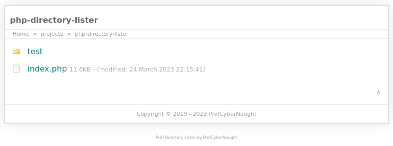
</div>

There are a total of **five custom copyright settings** to allow you to display your chosen copyright notice. The following are the five settings:

- $copyright_display_name
- $copyright_url
- $copyright_link_title_tag
- $copyright_year_start
- $copyright_year_end

<!-- HELP NOTICE: All sections must end with the 'back to top' link -->
<p align="right">(<a href="#readme-top">back to top</a>)</p>

#### Add Copyright Name

You can add a custom copyright name by changing the `$copyright_display_name` setting. The default setting looks like this:

`$copyright_display_name="ProfCyberNaught";`

An example of a custom copyright name could look like this:

`$copyright_display_name="Bart Simpson";`

<!-- HELP NOTICE: All sections must end with the 'back to top' link -->
<p align="right">(<a href="#readme-top">back to top</a>)</p>

#### Add Copyright Year

You can add a copyrght year or leave blank which will default to the current year in accordance with the time settings within your environment _(i.e., localhost)_. You are able to also set a copyright beginning year, along with a custom copyright end year. Some projects start in a certain year and end production in a certain year. This will allow you to reflect all the scenarios according to your copyright year needs.

<!-- HELP NOTICE: All sections must end with the 'back to top' link -->
<p align="right">(<a href="#readme-top">back to top</a>)</p>

##### Add Copyright Start Year

Adding a copyright start year is very simple. Sometimes, we need to add a start year because we originally started our projects at a certain time. All you need to do is change the `$copyright_year_start` setting and add your four digit year _(example: 2022)_.

By setting a custom copyright start year of `2022`, we are adding `2022 - ` after the copyright symbol ( &copy; ) but before the end year. The default is empty and will not be displayed.

<!-- HELP NOTICE: All sections must end with the 'back to top' link -->
<p align="right">(<a href="#readme-top">back to top</a>)</p>

##### Add Copyright End Year

Adding a specific copyright end year can be helpful to reflect if a project is no longer maintained or being developed. This would mean a copyright would finish at a certain time _(although, copyright would continue legally after this time)_. You have two scenarios with the end year:

- Leave blank _(automatically defaults to current localhost year)_
- Add custom year _(overrides current localhost year)_

**Automatically Default:**<br />
If you want to have your copyright automatically default to the localhost current year, you can leave the `$copyright_year_end` setting empty. This will by default display the current localhost year.

**Add Custom End Year:**<br />
If you want to override the automatic current year display, you can add your chosen copyright end year by changing the `$copyright_year_end` setting (adding your four digit year).

<!-- HELP NOTICE: All sections must end with the 'back to top' link -->
<p align="right">(<a href="#readme-top">back to top</a>)</p>

#### Add Copyright URL

You can add your own `URL` to the copyright statement. The `copyright name` you choose will be the text displayed for the link. You can choose any URL you want and add it to the `$copyright_url` setting. The default looks like this:

`$copyright_url="https://github.com/ProfCyberNaught";`

It is wise to always include your URL with encryption as default. Without encryption your link would start with `http://` but you should use encrypted URLs like so: `https://` _(the 's' stands for 'secure connection')_. Most browsers are defaulting to encrypted connections and some do not allow unencrypted connections to be established for privacy and security reasons _(depending on user or default internet browser settings)_.

However, if you are linking to a local resource within your **localhost**, you might want to use the standard `http://` protocol because in order to use the encrypted link action locally, you would need to have a **TLS Certificate** installed and validated _(signed by a trusted certificate authority 'CA')_ on your localhost environment. This can become very complex depending on your locahost setup and should be left to the more advanced users if required.

If you are linking to a resource online, use `https://` but if your resource is local (i.e., localhost/projects/index,php), use `http://` as standard to keep things easy.

Here is an example local resource: `$copyright_url="http://localhost/my-project/index.php";`<br />
Here is an example of an external (online) resource: `$copyright_url="https://github.com/YourUsernameHere";`

<!-- HELP NOTICE: All sections must end with the 'back to top' link -->
<p align="right">(<a href="#readme-top">back to top</a>)</p>

#### Add Copyright URL Title Tag

A title tag is used within a URL to allow people to see additional text when your cursor hovers over a link or to provide robots and search engines with additional information about the link. Here, you can choose your own copyright URL title tag. You can do this by changing the `$copyright_link_title_tag` setting and adding your own text to display and associate with your links.

The default looks like this: `$copyright_link_title_tag="ProfCyberNaught on GitHub";`

You could have anything you want like this: `$copyright_link_title_tag="Bart Simpson of Springfield USA";`

<!-- HELP NOTICE: All sections must end with the 'back to top' link -->
<p align="right">(<a href="#readme-top">back to top</a>)</p>

### Change Open Link Behaviour

When clicking links presented on pages, we can either have them open within the same window tab or open them in a new tab. This particular behaviour also depends on how your internet browser is setup by default or user preference changes made. Browsers have the ability to open links in a new tab or a new browser window. Most default to a new tab which is more user friendly.

The default setting for this **PHP Directory Lister** is set to open in the same tab. This means, if you use this single file solution in multiple directories and sub directories, you can simple click on the directory results and be directed to your chosen location within the same browser tab.

<!-- HELP NOTICE: All sections must end with the 'back to top' link -->
<p align="right">(<a href="#readme-top">back to top</a>)</p>

#### Open Links: Same Tab

If you want to set the link behaviour to open all links in the same tab (default), make sure the `$open_links_new_tab` setting states `FALSE`.

<!-- HELP NOTICE: All sections must end with the 'back to top' link -->
<p align="right">(<a href="#readme-top">back to top</a>)</p>

#### Open Links: New Tab

If you want to set the link behaviour to open all links in a new tab, you can change the `$open_links_new_tab` setting to `TRUE`.

<!-- HELP NOTICE: All sections must end with the 'back to top' link -->
<p align="right">(<a href="#readme-top">back to top</a>)</p>

## FAQ Section

Here are some commonly asked questions about the **PHP Directory Lister**. If you do not see your question answered, you can [open a new issue](https://github.com/ProfCyberNaught/php-directory-lister-breadcrumbs-non-recursive/issues "Open a New Issue - Ask a question - PHP Directory Lister - ProfCyberNaught") or [contact](#contact "Contact - PHP Directory Lister - ProfCyberNaught") ProfCyberNaught directly.

Click on each question to expand and display the answer.

<details><summary>What can this file be used for?</summary>

There are a number of ways in which you can use this **PHP Directory Lister**:

- Display contents of single directory
- Have a more visually appealing display
- Have a customised directory viewing solution
- Use in your localhost environment
- Have custom settings for each individual directory
- Store in multiple directories creating a consistent visual appeal
- Hide or show certain files and folders
- Create custom solutions based on specific project needs
- Quick and simple solution to your needs
- Implement a single file solution

Why not [drop us a message](#contact "Contact - PHP Directory Lister - ProfCyberNaught") and let us know how you have used the **PHP Directory Lister** or if you have future feature requests, [open up an issue](https://github.com/ProfCyberNaught/php-directory-lister-breadcrumbs-non-recursive/issues "Open a New Issue - Feature Request - PHP Directory Lister - ProfCyberNaught") and let us know your ideas.
</details>
<details><summary>What is non-recursive behaviour?</summary>

**Recursive** is a function which calls itself again and again. A **recursive function** in general has an extremely _high time complexity_ while a **non-recursive** one does not. A _recursive function_ generally has a smaller code size whereas a **non-recursive** one is larger. **Non Recursive Functions** are procedures or subroutines implemented in a _programming language_, whose implementation does not references itself.

A simple way to understand this process when listing directories is: a **non-recursive feature** only lists what is inside the current directory. A _recursive feature_ would repeat the process _(self-reflecting loop)_ looking into the current directory, then all sub directory contents _(can be limited to a certain depth)_ and combine all the results into a single display.
</details>
<details><summary>Why is it non-recursive?</summary>

The **PHP Directory Lister** has been developed to be `non-recursive` because the goal was to display the directories and files within the same directory the `index.php` file is stored. By listing files and directories within sub directories could result in a long folder tree list, and could take up more system processes and resources. Having a full directory tree list visable is only beneficial in certain circumstances. Most of the time, we just need to know what is currently in our viewed directory.

This **PHP Directory Lister** is aimed at the _localhost developer_ whom wants to have a more _visually appealing directory contents list_ compared to the standard `Apache` implementation. At the same time, presenting _additional customisable options_ all within a _'single file solution'_.
</details>
<details><summary>Why has the file been minified?</summary>

**Minifying code** has been happening for many years. Even back before `PHP 5.5`, people were attempting to save server resources by _minifying their code_. However, the **PHP language** as an example has moved on from the need to _minify the code_ to see some real benefits. However, there are still good reasons to minify code:

- Stop using additional resources
- Reducing the overall file size
- Obfuscate your code

The above are still _valid reasons for minifying your code_ and this practice still goes on today. However, if you were _minifying to reduce loading times_ and related server resources, a better solution would be using some type of _cache system_. From `PHP 5.5+`, some form of _caching process_ was implemented by default _(such as opcode - PHP Accelerator and APC solutions)_. **Not all caching is created equally so do your research first.**
</details>
<details><summary>Why are the icons base64 encoded?</summary>

The main _design principle_ for developing this **PHP Directory Lister** to is to maintain the _'single file solution'_ methodology. This allows the whole thing to be run using a single file called `index.php`. All you would need to do is download this one file, copy to your **localhost** and away you go. You do not have to change any of the default settings and most things are activated by default.

If the icon files were included as separate files, this would result in additional files and possibly directories being required to run this solution. This went against the _design principles_.
</details>
<details><summary>Why do you not supply a default favicon file?</summary>

This **PHP Directory Lister** has been developed with the principle of making it a _'single file solution'_. This means, in order to use this **PHP Directory Lister**, all you need is the `index.php` file and you are good to go. The directory and file icons have been included as `Base64` so the whole project remains a _singular file instance_.

It is possible to include a favicon as embedded `Base64` code. However, certain devices _(especially Apple)_ render the **favicon** using different methods. As such, it is better to stick with the most widely accepted method for displaying favicons. Due to the _single file solution_ principle in the design process, it was chosen to not supply a favicon file because this would mean either an additional `.ico` file needs to be copied along with the `index.php` file, or an internet connection would be needed to load a _remote favicon_. The other solution was to risk the favicon not displaying correctly by embedding it as Base64 code.

The favicon icon display is disabled by default using the `$display_favicon` setting.
</details>
<details><summary>Why are my links opening in a new window and not another tab?</summary>

This will likely be related to your specific _internet browser_ or device settings. Most devices and internet browsers will default to opening new links in a new tab instead of a new window. However, if you are experiencing this issue, I advise you to check your _internet browser_ or device settings to make sure new links are opened in a new tab only.
</details>
<details><summary>Does this file need PHP to display?</summary>

The name of the project is called **PHP Directory Lister**. This means you will need to have **PHP** running within your _localhost environment_ to be able to use it. Most remote and local services have **PHP** as standard. Examples of localhost solutions include `XAMPP` or `LAMPP` solutions for `Windows`, `Mac OS` and `Linux` operating systems. You can even have **localhost** running on mobile devices with **PHP** if you wish.

This **PHP Directory Lister** has been coded with `PHP 8.0+` in mind. However, it should work on older versions of **PHP** that have the dependancies. Remember, an old version of **PHP** might not support commonly accepted practices or certain functions and features might not exist; as they were introduced at a later date. It is always better to run your applications on newer environments taking advantage of _server resource optimisations_ and _better coding standards_. However, this project should run on `PHP 5+` upto and including the latest version.

The project would actually run on `PHP 4.0+` if the `is_dir()` function was not used. However, because it is, you must make sure you are running `PHP 5.0+`.
</details>
<details><summary>What is a localhost environment?</summary>

**Localhost** is a hostname that refers to the local machine currently making the request. On many computers, **localhost** is an alias for the **IP** address `127.0.0.1`. When a computer _pings_ this IP address, it is communicating with itself. **Localhost** is useful for software testing and security purposes independent of a larger network. Usually, you will find `Apache`, `SQL`, and `PHP` running within this environment because it allows the user to accomplish many different development tasks. It also allows the user to experiment on a local copy and test for issues before uploading it to a _production environment_. A production environment is normally referred to as the remote server _(possible publicly facing depending on needs)_, and **localhost** is commonly referred to as the development environment where things are changed and experimented upon without affecting the main remote source.
</details>
<details><summary>What is a favicon icon?</summary>

A **favicon** is a small little icon normally `16x16` in size _(depending on device or software)_ which can be displayed in your _browser tab window_. It can also be used as a _graphic representation_ of the current site you are viewing. These **favicons** can also be used to display on shortcuts or bookmarks on your system.

If you have an _image file_ you would like converting to an **favicon** to use with this **PHP Directory Lister**, you can use plenty of online resources which provide a free service to convert your image to a **favicon**. This can then be saved to your local environment, and linked to directly within the settings.
</details>
<details><summary>Why have you only used two icons in the results?</summary>

There are a very large number of different _file types_ used all over the world. Certain _operating systems_ have different _file extension names_, even different software packages or applications can have their own _custom file extensions_. As such, to include even the most common file extensions and have them represented as a specific icon in your results would render the single file solution very large. Even if this was done, as soon as a new piece of software is released, or changes are made to existing software, the icon list would be outdated.

Using only two icons helps _simplify the visual representation_ of your contents. A single icon to represent _directories and folders_ and a single icon to represent a _file_. This keeps it _simple and easy_ to quickly recognise if a item in the results is a _directory or a file_. The hover title tags also display if the item is a directory or a file just in case you have disabled icons from displaying.
</details>
<details><summary>Why does my subtitle not display on the screen?</summary>

If your subtitle is not displaying on your screen, you need to check you have content within the `$page_subtitle` setting, and the `$display_page_subtitle` settings has been set to `TRUE`.
</details>
<details><summary>Can I just display the subtitle and not the main title?</summary>

You must have the page title `$display_page_title` setting on `TRUE` first in order to have the subtitle appear on your screen. The idea of a subtitle is to be 'underneath' _(i.e., sub)_ the main page title. If you just want a single title to appear, you can disable the subtitle by changing the `$display_page_subtitle` to `FALSE` and just use the main page title instead.
</details>
<details><summary>Can I remove the footer text at the bottom?</summary>

It would be preferred if you did not remove the footer text from the bottom out of respect for the **open-source project** and to spread the word of this free resource presented here within the **GitHub repository**. An intermediate or advanced **PHP coder** could easily remove the footer from the bottom. However, this would be taking something from an _open-source project_ and removing any recognition of the source developer. This is commonly frowned upon in the _open-source and development community_ as a whole. I will not assist in removing all recognition of whom developed this project and this is something you would have to circumvent yourself _(ethical and moral questions might be raised)_. _*Even I have referenced the original GitHub account, and the legacy icon pack used below._
</details>
<details><summary>Why does the footer text open in new tab when I have disabled new tab setting?</summary>

The footer text at the bottom of the **PHP Directory Lister** page is set as default to open in a new tab _(or new window depending on your browser settings)_. This is because it links back to this repository and is an external source. This behaviour cannot be changed within the user settings and customisations without understanding the **PHP coding language**. This would require additional changes to the _minified code section_ but I recommend not changing this behaviour or removing the footer text. However, an intermediate or advanced programmer in **PHP** could change the behaviour or remove completely.
</details>
<details><summary>Do you have a demo site where this can be seen working?</summary>

There is _no demo site_ because generally on **production servers** or **remote public facing services**, it is best to not have your directories being listed because it could result in certain files being displayed that you would not want a general visitor/user to see. However, this `README.md` file contains many **screenshots** clearly displaying how the **PHP Directory Lister** looks as default, including with user **settings changed**, and both **Light Mode** and **Dark Mode** information.
</details>
<details><summary>Why I am getting a blank screen instead of the directory results?</summary>

There could be a number of reasons and they could be endless. The first point of call is to make sure your environment has **PHP** running on your **localhost**. You may also want to turn on errors and warnings in the `php.ini` file to display any errors that may have neen caused. You could also check your `localhost Apache logs` if they are enabled.

The second and most common option is a change you have made to the file has resulted in a **PHP** syntax error. Turning on errors and warnings within your `php.ini` file will help resolve this. You could also check your `localhost Apache logs` if they are enabled.

When changing user settings and options at the top of the file, make sure you have kept the layout and syntax the same. For example, when changing a setting, make sure the setting has a variable name `$page_title`, an equals sign ` = `, and your `TRUE` or `FALSE` values are wrapped in quotation marks ` " " `.
</details>
<details><summary>My exclusion list is not hiding my specific file or folder?</summary>

The items within your exclusion list _must match exactly_ the directory or file name. If your directory starts with a full stop ` . `, this represents a system hidden file and your exclusion list must also have this full stop if you want to exclude it. Files have extensions attached to them such as `.php`, `.txt`, `.htaccess`, `.png`, `.config` and even custom extensions `.myext`. Your exclusion entry must also have this extension along with the file name. As an example, if you wish to not display this index file, you can add `index.php` to your exclusions list.

<ins>**IMPORTANT:**</ins> _Each exclusion item must be separated by a comma ` , ` unless it is the last item in the list. If you do not use a comma, you could be presented with a blank screen because the comma is needed to correct `PHP` syntax code. Having your `php.ini` file set to display errors and warnings or checking your Apache logs would really help in these situations._

Another scenario is making sure you have used the correct character case `uppercase` and `lowercase` values. It must match your exact directory or file name.

Pay attention to using _special characters_ when naming files. Certain characters should be avoided as they will be interpreted by **PHP** as syntax. You should aim to only use `uppercase` and `lowercase` letters, `hyphens`, `underscores` and `full stops (periods)` in your directory and file names. Try to _avoid using spaces_ in your directory and file names too as this is _bad practice_. A space might look like nothing is there but actually, a space is a character itself and goes by the _HTML Charset_ value number: 32.
</details>
<details><summary>I cannot see certain folders or files even though they are not in my exclusions list?</summary>

Certain _directories and files_ are hidden by the system your _localhost_ is running on. For example, the most common environment on a home pc is _Microsoft Windows_. By default, files _(starting with a full stop)_ are hidden from the user. This is normally because they contain _important information_ that should not be changed without more _advanced knowledge_. However, you can change the _default file and directory views_ in the file manager settings. This is also the same for `OS X`, `Linux`, and even `mobile devices`. You may need to adjust your _system settings_ to see such _directories and files_. However, **be careful** as this will have a _system wide impact_ and all hidden files _(especialy important ones)_ will become visable on your host system. Always tread carefully when dealing with hidden system files because it is easy to accidentally delete a system dependant _hidden file or directory_.
</details>

<!-- HELP NOTICE: All sections must end with the 'back to top' link -->
<p align="right">(<a href="#readme-top">back to top</a>)</p>

<!-- CONTACT -->
## Contact

Mastodon: [@profcybernaught](https://infosec.exchange/@ProfCyberNaught)

Encrypted Email: [profcybernaught - Proton - me](#)

Public Email Key: [Public Encryption Key](https://github.com/ProfCyberNaught/ProfCyberNaught/blob/main/pcn_pek_email/)

Website Link: [https://profcybernaught.hashnode.dev/](https://profcybernaught.hashnode.dev/)

<!-- HELP NOTICE: All sections must end with the 'back to top' link -->
<p align="right">(<a href="#readme-top">back to top</a>)</p>

## Attribution:

This **PHP Directory Lister** project was created by **@ProfCyberNaught**. This project has been distributed via the **@ProfCyberNaught GitHub repository** found by visiting the following link: [PHP Directory Lister - ProfCyberNaught - GitHub Repository](https://github.com/ProfCyberNaught/php-directory-lister-breadcrumbs-non-recursive "PHP Directory Lister - ProfCyberNaught - GitHub Repository")

If you decide to use this project, please do **leave the attribution code comments and main footer text intact to support the open-source directive and the developer**.

<!-- HELP NOTICE: All sections must end with the 'back to top' link -->
<p align="right">(<a href="#readme-top">back to top</a>)</p>

### Original Concept

Having used my own **custom directory listers** for many years on my projects and _localhost environments_, even _remote environments_ where required, I felt it was time to release something containing those **features**. I was looking around the internet checking _coding forums_, looking at _existing projects_ and could not really see anything that would provide me with the **solutions** I needed or currently had in multiple in-house projects. I know other **developers** end up having to _create their own solutions_ within their **localhost** or certain projects.

I came across a _similar project_ when viewing the following profile: [Click Here](https://github.com/jpederson "jpederson on GitHub"). Even though the layout itself was acceptable to a certain degree _(did have issues on certain screen sizes)_, it lacked a lot of **functionality**, **customisable options**, and different **theme options**. Not everyone wants to see a bright white screen when they are **coding** late into the evening like most **developers** do. I personally am I big fan of anything **Dark Mode** and this was a feature that had to be implemented.

Below is a list of issues and concerns with the _original layout_ and _functionality_:

- Light Mode was the only option
- No Dark Mode theme
- No custom options to change accent colours
- Directories not listed at the top
- Files not listed underneath directories
- Many file types not having specific icons (seeming outdated)
- Not updated for many years
- No breadcrumb display options
- No `back to top` solutions for larger directory lists
- No last modified data
- No page title options
- No page subtitle options
- No copyright solutions
- No hover over text details
- No ability to disable displaying icons
- No favicon solutions
- No option to remove the hover highlight bar
- No option to remove file size details
- No control over how links open
- Larger overall file size for a simpler solution without additional features
- No detailed customisable copyright options
- No customisable options available
- No instructions of usage
- No instructions for exclusion list
- Struggles displaying on multiple mobile devices
- No explanation of principles used
- No instructions of usage
- Gives impression only a limited number of supported file formats
- Loads external resources from Google on a localhost environment
- Loads unnecessary remote files
- Security risks loading remote content on localhost
- No control over loaded remote content data
- Code not minified
- HTML defaulted to `en` language

Above is a list of issues in my personal opinion that needed addressing. All the items listed above have been _implemented, changed, corrected, and/or removed_ for security purposes. One of the major issues for me was the resulting **list order**, no **dark mode solutions**, and a _major security risk_ loading external resources into your localhost environment for such a simple solution.

I knew I could use my existing directory listing solutions I have and create a more advanced **PHP Directory Lister** supporting many different **features**, **customisable options**, and consider a more **secure position** regarding running files on your localhost. I am also a **privacy advocate** and _do not agree_ with needlessly loading Google-related resources for no good reason.

It was a **pleasure to develop** and integrate together all the **solutions** mentioned above. It took longer than I thought because I was thinking of all the **solutions** I currently had in my many **project directories being listed**. Creating this `README.md` file took me a long time making sure all the **screenshots** were available, and indepth **usage instructions** were available to the user.

There are **additional functions** I would consider adding and these have been mentioned in sections above.

<!-- HELP NOTICE: All sections must end with the 'back to top' link -->
<p align="right">(<a href="#readme-top">back to top</a>)</p>

### Icon Usage

Within this **PHP Directory Lister**, there are two icons which have been stored as **Base64** code. This helps to keep the _'single file solution'_ methodology, but also provide less work and a simpler way to recognise which list result represents a _directory or a file_. However, the original icons were taken from a very old icon package called _'Silk Icon Pack'_. This was originally available from the _FamFamFam Website_ but now, the website no longer exists. I did however, manage to find a very old repository that dates back to 2015 which still contains the _icon package_.

To view the legacy icon _famfamfam silk icon_ repository, [click here](https://github.com/legacy-icons/ "Silk Icon Pack")

<!-- HELP NOTICE: All sections must end with the 'back to top' link -->
<p align="right">(<a href="#readme-top">back to top</a>)</p>

<!-- MARKDOWN LINKS & IMAGES -->

<!-- Contributors Total -->
[contributors-shield]: https://img.shields.io/github/contributors/ProfCyberNaught/php-directory-lister-breadcrumbs-non-recursive.svg?style=for-the-badge
[contributors-url]: https://github.com/ProfCyberNaught/php-directory-lister-breadcrumbs-non-recursive/graphs/contributors

<!-- Folks Total -->
[forks-shield]: https://img.shields.io/github/forks/ProfCyberNaught/php-directory-lister-breadcrumbs-non-recursive.svg?style=for-the-badge
[forks-url]: https://github.com/ProfCyberNaught/php-directory-lister-breadcrumbs-non-recursive/network/members

<!-- Stars Total -->
[stars-shield]: https://img.shields.io/github/stars/ProfCyberNaught/php-directory-lister-breadcrumbs-non-recursive.svg?style=for-the-badge
[stars-url]: https://github.com/ProfCyberNaught/php-directory-lister-breadcrumbs-non-recursive/stargazers

<!-- Issues Total -->
[issues-shield]: https://img.shields.io/github/issues/ProfCyberNaught/php-directory-lister-breadcrumbs-non-recursive.svg?style=for-the-badge
[issues-url]: https://github.com/ProfCyberNaught/php-directory-lister-breadcrumbs-non-recursive/issues

<!-- LICENSING LINK: If you intend to use an open-source license from: https://choosealicense.com/ use the following: -->
[license-shield]: https://img.shields.io/github/license/ProfCyberNaught/php-directory-lister-breadcrumbs-non-recursive.svg?style=for-the-badge
<!-- OTHERWISE: You will need to create your own link reference based on the license code used - example below: -->
<!-- [license-shield]: https://img.shields.io/badge/License:%20CC%20BY%20NC%20ND%204.0-grey?style=for-the-badge -->
<!-- HELP NOTICE: Leave the following license link as all license files will be named the same -->
[license-url]: ./LICENSE

<!-- Project Screenshot -->
[project-screenshot]: screenshots/darkmode_php_directory_lister_profcybernaught.png